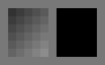
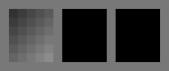
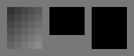

# Prism

Dimensions: y, x. Compute at blur_v.x, store at blur_v.x
  

Dimensions: y, x. Compute at root, store at root
  

Dimensions: y, x. Compute at blur_v.x, store at root
  

Dimensions: yo, y, x. Compute at blur_v.yo, store at blur_v.yo
  

Dimension: yo, xo, y, x. Compute at blur_v.xo, store at blur_v.xo
  
